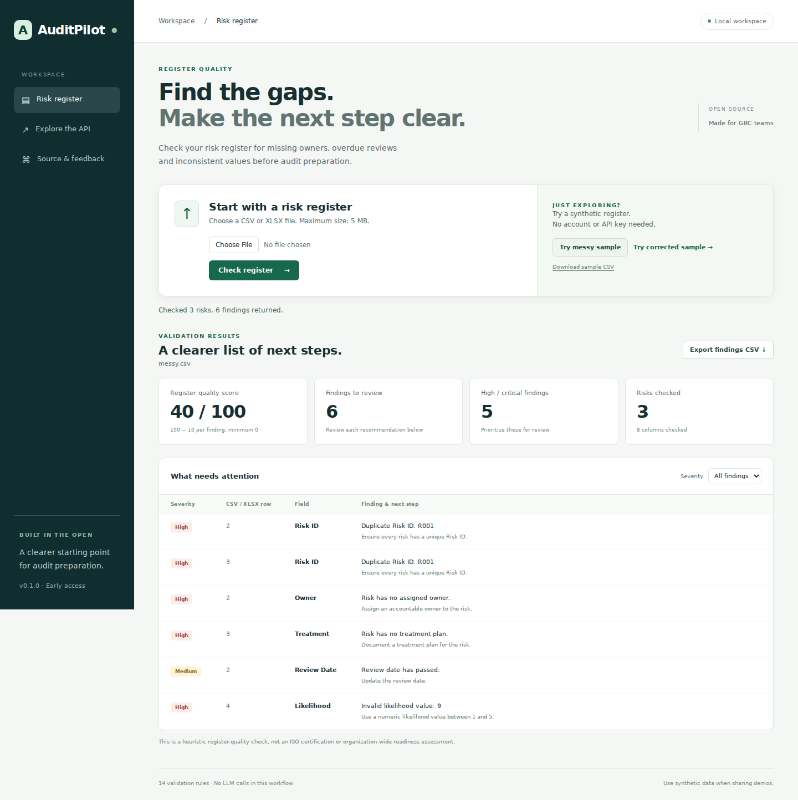

<div align="center">

# AuditPilot

### Find problems in your risk register before audit preparation.

An open-source toolkit for register validation, evidence checks, and a starter ISO/IEC 27001 mapping workflow.

[](https://github.com/anirudhnshandilya/auditpilot/actions/workflows/ci.yml)
[](backend/pyproject.toml)
[](LICENSE)
[](#scope-and-limits)

[Try the demo](#try-it-locally) · [Watch the demo](docs/assets/auditpilot-demo.mp4) · [Sample data](examples) · [Walkthrough](docs/DEMO.md) · [Contribute](CONTRIBUTING.md)

</div>



**Missing owners. Duplicate risk IDs. Overdue reviews. Invalid values.**
AuditPilot turns a CSV or XLSX into row-level findings and recommended next steps. Review the findings, export them, update your register, and check again.

The browser demo uses the real validation API. **No account, API key, or LLM is required for these workflows.** Run the application locally; file validation happens in your running AuditPilot instance.

## Try it locally

### Docker

With Docker and the Docker Compose plugin installed, run these commands from a terminal:

```bash
git clone https://github.com/anirudhnshandilya/auditpilot.git
cd auditpilot
docker compose up --build
```

Open **[http://127.0.0.1:8000/demo](http://127.0.0.1:8000/demo)**.

1. Click **Try messy sample**: three risks, six findings, quality score **40/100**.
2. Review the affected rows and recommended fixes. Export the findings as CSV.
3. Click **Try corrected sample**: three risks, zero findings, quality score **100/100**.
4. Upload your own CSV / XLSX when you are ready.

The score is `max(0, 100 − 10 × findings)`. It measures checks on the register, **not certification or overall organizational compliance**. Fixing sample data demonstrates the rules; it does not establish the effectiveness of real risk treatments.

Stop the application with `Ctrl+C`, then `docker compose down`. The default Docker port binding is local to your machine.

### Python

Requirements: **Python 3.12+** and [uv](https://docs.astral.sh/uv/getting-started/installation/).

```bash
git clone https://github.com/anirudhnshandilya/auditpilot.git
cd auditpilot/backend
uv sync --frozen
uv run uvicorn app.main:app --reload
```

Open **[the browser demo](http://127.0.0.1:8000/demo)** or **[the interactive API](http://127.0.0.1:8000/docs)**. These commands also work in PowerShell.

### Repeatable API walkthrough

From `backend`:

```bash
uv run python ../scripts/demo.py
```

This calls the real application through its test client and demonstrates:

```text
MESSY: 3 risks | 6 findings | quality score 40/100
CORRECTED: 3 risks | 0 findings | quality score 100/100
draft-policy.txt: Human review required | mapped controls ['A.5.1']
approved-policy.txt: Sufficient | mapped controls ['A.5.1']
```

To exercise your running local server and capture the results:

```bash
uv run python ../scripts/demo.py --base-url http://127.0.0.1:8000 --output demo-results.json
```

The script removes its synthetic evidence uploads afterwards. Coverage responses include any other evidence already held by that server; use a fresh instance for the published walkthrough.

## What works today

| Workflow | Current behavior |
|---|---|
| Risk registers | CSV / XLSX uploads, 14 validation rules, row-level recommendations |
| Browser demo | Upload, messy / corrected samples, severity filtering, findings CSV export |
| Evidence processing | PDF, DOCX, TXT, CSV, XLSX; text extraction and metadata |
| Evidence checks | Deterministic draft, approval-marker and version-marker checks |
| Control mapping | Keyword matches against the **A.5.1 / A.5.2 starter subset** |
| Gap and action suggestions | Expected-evidence gaps and CAPA-style recommendations for that subset |
| Developer API | FastAPI, OpenAPI / Swagger, typed domain models |

## Scope and limits

**Early access.** The ISO control library currently contains **two controls**, not the full framework. Mapping scores are keyword-match ratios, not calibrated AI confidence. Coverage and compliance scores refer only to the loaded control subset.

The evidence status `Sufficient` means approval and version markers were found by the implemented checks. It does not prove authentic approval, policy implementation, audit acceptance, or certification. Keyword mapping can include documents flagged for human review; always examine evidence quality separately.

Evidence is held in memory and is lost when the process restarts. Action generation currently returns suggestions rather than a persistent task-management workflow. Authentication, a full dashboard, database persistence, additional frameworks, and an AI copilot are future work.

The demo is intended for local development and evaluation. Use synthetic documents for public recordings. See [SECURITY.md](SECURITY.md) before adapting it for a shared deployment.

## Register format

Use these exact column names:

```text
Risk ID,Title,Description,Owner,Treatment,Likelihood,Impact,Review Date
```

Likelihood and impact must be numeric values from 1 to 5. Use ISO dates (`YYYY-MM-DD`) for review dates. Finding row numbers include the header row; row `0` means a whole-file issue.

The implemented rules check missing / duplicate IDs, owners, titles, descriptions, treatment plans, missing / invalid / overdue review dates, invalid likelihood / impact, duplicate / empty rows, and missing required columns.

The browser samples use dates relative to today so they keep demonstrating the same defects. Download them from the demo or regenerate the checked-in examples:

```bash
# From the repository root; no third-party packages needed
python scripts/write_samples.py
```

See [examples/README.md](examples/README.md) for the exact defects and corrections.

## API

| Method | Endpoint | Purpose |
|---|---|---|
| GET | `/health` | Health check |
| POST | `/upload/risk-register` | Validate a CSV / XLSX; maximum 5 MB |
| POST | `/evidence/upload` | Process evidence; maximum 10 MB |
| GET | `/evidence` | List in-memory evidence |
| GET | `/evidence/summary` | Evidence insights |
| GET / DELETE | `/evidence/{document_id}` | Retrieve / delete evidence |
| GET | `/frameworks/iso27001` | List the two-control starter subset |
| GET | `/frameworks/iso27001/coverage` | Coverage within that subset |
| GET | `/frameworks/iso27001/gaps` | Missing evidence suggestions |
| GET | `/frameworks/iso27001/score` | Subset-based score |
| GET | `/remediation/actions` | Suggested CAPA-style actions |

## Development

From `backend`:

```bash
uv sync --frozen
uv run pytest -q
uv run mypy app
uv run ruff check . ../scripts/demo.py ../scripts/write_samples.py
```

[CI](.github/workflows/ci.yml) runs these checks, exercises the walkthrough, builds the Docker image, checks the browser workflow, and checks the running container. The browser interface is served by FastAPI and needs no Node build step. Optional browser regression checks are documented in [docs/DEMO.md](docs/DEMO.md).

```text
backend/app/validators/  → register rules and validation engine
backend/app/services/    → evidence parsing, metadata and quality checks
backend/app/frameworks/  → starter controls, mapping, gaps and scoring
backend/app/remediation/ → suggested actions
backend/app/static/      → browser demo
backend/app/demo/        → synthetic samples
scripts/demo.py         → repeatable API walkthrough
```

## Help shape AuditPilot

Try the synthetic demo and tell us which finding or workflow would help your team. For a reproducible report, use the [bug template](.github/ISSUE_TEMPLATE/bug_report.yml) and synthetic data.

Useful next contributions include better spreadsheet handling, validated framework extensions, evidence-review workflows, persistent actions, and clearer reporting. Start with [CONTRIBUTING.md](CONTRIBUTING.md) and the [roadmap](docs/roadmap.md).

If AuditPilot is useful to you, **[star the repository](https://github.com/anirudhnshandilya/auditpilot)** to help others discover it.

## Maintainers

| Name | Role | Focus |
|---|---|---|
| Anirudh N Shandilya | Project Co-Lead and Cybersecurity Engineer | Security, GRC, backend architecture and open-source project management |
| Suryakiran Suresh | Project Co-Lead and AI and Data Science Contributor | Machine learning, NLP, analytics and AI model development |

Licensed under [Apache 2.0](LICENSE). Security reports: [SECURITY.md](SECURITY.md).
